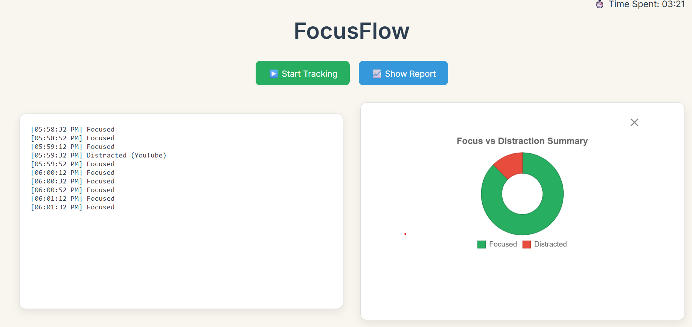

🎯 FocusFlow – Real-time Distraction Tracker

FocusFlow is a lightweight backend-powered distraction tracking tool built using Golang. It allows users to start a productivity session and monitors their focus in real time. With live log streaming using Server-Sent Events (SSE), OS signal handling, and structured summaries, it's a clean and efficient way to measure attention.

🚀 Features

- 🧠 Real-time distraction tracking via goroutines
- 🔁 Server-Sent Events (SSE) for live log streaming to frontend
- 🧵 Concurrent processing using channels and WaitGroups
- 💾 Generates summary report after each session
- 🛑 Graceful shutdown using OS signal handling (Ctrl+C / SIGTERM)
- 🌐 Clean routing using Go's net/http package

🛠️ Tech Stack

- Language: Golang
- Concurrency: Goroutines, Channels, WaitGroup
- Frontend: HTML/CSS (via templates)
- Log Streaming: Server-Sent Events (SSE)
- Signal Handling: os/signal, syscall
- Routing: net/http

  
Live log streaming with distraction tracking dashboard

